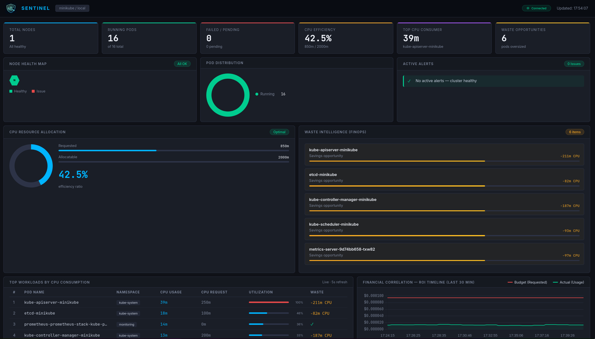

# 🛡️ Sentinel

<p align="center">
  
</p>

> Plataforma minimalista de observabilidade e FinOps para clusters Kubernetes — dashboard em tempo real, análise de incidentes com LLM e rastreamento de custo por pod.

<p align="center">
  
</p>


---

## O que é

Sentinel evoluiu de um agente de monitoramento reativo para uma plataforma completa de observabilidade e FinOps. A arquitetura combina duas camadas complementares:

- **Go Agent** — dashboard web proativo em tempo real (porta 8080), coleta contínua de métricas e histórico de custo por pod persistido no PostgreSQL
- **Claude Code** — análise de incidentes sob demanda com raciocínio LLM, geração de runbooks e recomendações de remediação

O projeto demonstra na prática:
- **Go agent** com Kubernetes client-go para coleta autônoma de métricas
- **FinOps** — rastreamento de waste (recursos alocados vs utilizados) e histórico de custo por pod
- **MCP Servers** para integração com Prometheus e kubectl
- **CLAUDE.md** como contexto operacional persistente
- **Slash commands** como interface de resposta a incidentes

---

## Arquitetura

```
┌─────────────────────────────────────────────────────┐
│                   Go Agent (porta 8080)             │
│  coleta contínua → PostgreSQL → dashboard em tempo  │
│  real com custo por pod e histórico de 30min        │
└───────────────────────┬─────────────────────────────┘
                        │ /api/summary /api/metrics /api/history
                        ▼
┌─────────────────────────────────────────────────────┐
│                  Claude Code                        │
│                                                     │
│  /startup                                           │
│    └─ Minikube + port-forwards + Go agent           │
│                                                     │
│  /incident                                          │
│    └─ consome API do Go agent                       │
│    └─ raciocínio LLM + análise FinOps               │
│    └─ classifica severidade                         │
│    └─ gera runbook/relatório via harness            │
└─────────────────────────────────────────────────────┘
```

---

## Stack

| Camada | Tecnologia |
|---|---|
| Cluster | Minikube (KVM2) — Kubernetes v1.35.1 |
| Monitoramento | kube-prometheus-stack (Prometheus + Grafana + AlertManager) |
| Dashboard | Go agent (Kubernetes client-go + net/http) |
| Persistência | PostgreSQL (`sentinel_db`) |
| Agente LLM | Claude Code |
| Integrações | MCP Server Prometheus + MCP Server kubectl |
| Output | Runbooks e relatórios em Markdown (validados pelo harness) |

---

## Pré-requisitos

- [Claude Code](https://claude.ai/code) instalado e autenticado
- Minikube rodando com o namespace `monitoring`
- Helm 3.x
- Go 1.21+
- PostgreSQL local com database `sentinel_db`
- Node.js (para os MCP Servers via npx)

---

## Setup

### 1. Stack de monitoramento

```bash
helm repo add prometheus-community https://prometheus-community.github.io/helm-charts
helm repo update

kubectl create namespace monitoring

helm install prometheus-stack prometheus-community/kube-prometheus-stack \
  --namespace monitoring \
  --set grafana.adminPassword=admin123
```

### 2. PostgreSQL

```bash
createdb sentinel_db
```

Variáveis de ambiente opcionais (defaults: `postgres` / `postgres` / `localhost`):

```bash
export DB_USER=postgres
export DB_PASSWORD=postgres
export DB_NAME=sentinel_db
export DB_HOST=localhost
export DB_SSLMODE=disable
export DB_TIMEOUT_SEC=5
```

### 3. Clone e MCP Servers

```bash
git clone https://github.com/boccato85/Sentinel
cd sentinel

claude mcp add prometheus -- npx -y prometheus-mcp-server
claude mcp add kubectl -- npx -y kubectl-mcp-server
```

### 4. Go Agent

```bash
cd agent
make build   # compila o binário
make start   # inicia o serviço (ou use /startup que faz isso automaticamente)
```

---

## Uso

```bash
claude
```

**Bootstrap do ambiente:**
```
/startup
```
Verifica Minikube, sobe port-forwards de Prometheus/Grafana/AlertManager e inicia o Go agent se estiver down. Output:

```
 Prometheus    (localhost:9090)  →  ✅ OK
 Grafana       (localhost:3000)  →  ✅ STARTED
 AlertManager  (localhost:9093)  →  ✅ OK
 Go Agent      (localhost:8080)  →  ✅ STARTED
```

**Análise de incidente:**
```
/incident
```
Consome os dados do Go agent, aplica raciocínio LLM com análise FinOps e gera o relatório ou runbook automaticamente.

---

## Go Agent — Dashboard

Após o `/startup`, acesse `http://localhost:8080`.

| Endpoint | Descrição |
|---|---|
| `GET /` | Dashboard Dynatrace-style (HTML) |
| `GET /api/summary` | Estado do cluster: nodes, pods, CPU |
| `GET /api/metrics` | Métricas por pod: CPU usage, waste (`cpuRequestPresent`, `potentialSavingMCpu`) |
| `GET /api/history` | Histórico de custo dos últimos 30 min |

Gerenciamento manual:

```bash
cd agent/
make start    # compila + inicia o serviço em background
make stop     # para o serviço
make restart  # recompila e reinicia
make status   # estado atual
make logs     # tail dos logs em tempo real
```

---

## Outputs gerados pelo /incident

### Relatório WARNING / OK
```
reports/2026-04-05_14-30_WARNING.md
```
Contém: estado do cluster, métricas no momento, análise de waste por pod, tendência de custo e recomendações com comandos kubectl prontos.

### Runbook CRITICAL
```
runbooks/2026-04-05_14-30_CRITICAL_prometheus.md
```
Contém: situação detectada, métricas no momento do incidente, análise FinOps, hipóteses de causa raiz e checklist de remediação.

---

## Thresholds

Definidos em `config/thresholds.yaml` — source of truth único, lido em runtime por todos os componentes.

| Métrica | WARNING | CRITICAL |
|---|---|---|
| CPU | > 70% | > 85% |
| Memória | > 75% | > 90% |
| Disco | > 70% | > 85% |
| Pod CrashLoopBackOff | — | imediato |
| Pod Pending > 5min | ✓ | — |
| Waste por pod | > 60% | — |

---

## Estrutura do projeto

```
sentinel/
├── CLAUDE.md                        # Contexto operacional do agente
├── README.md
├── .mcp.json                        # Configuração dos MCP Servers
├── .gitignore
├── agent/
│   ├── main.go                      # Go agent: dashboard + coleta + PostgreSQL
│   ├── go.mod / go.sum
│   └── Makefile                     # build, start, stop, restart, status, logs
├── config/
│   └── thresholds.yaml              # Source of truth único de thresholds
├── tools/
│   ├── monitor.py                   # Coleta paralela K8s + Prometheus
│   └── report_tool.py               # Gravação segura via harness
├── harness/
│   └── validador_saida.py           # Gatekeeper: bloqueia destrutivos, exige Resumo Executivo
├── .claude/
│   └── commands/
│       ├── startup.md               # Bootstrap: Minikube + port-forwards + Go agent
│       └── incident.md              # Análise LLM + runbook via Go agent API
├── runbooks/                        # Runbooks CRITICAL gerados
└── reports/                         # Relatórios WARNING/OK gerados
```

---

## Harness Engineering

Todo relatório final passa pelo `harness/validador_saida.py` antes de ser gravado em disco. O validador aplica:

| Regra | Comportamento |
|---|---|
| Bloqueia comandos destrutivos | `rm -rf`, `kubectl delete`, `DROP TABLE`, `dd if=`, `mkfs`, fork bomb etc. |
| Exige `## Resumo Executivo` | Relatórios sem essa seção são rejeitados |
| Tamanho mínimo | Conteúdo menor que 100 caracteres é rejeitado |

Se qualquer regra for violada, o arquivo **não é criado**.

Variáveis úteis do fluxo de relatório:

```bash
export HARNESS_TIMEOUT_SEC=10
```

---

## Changelog

### v2.0
- **Go agent** (`agent/`) com dashboard web em tempo real na porta 8080
- **FinOps** — rastreamento de waste por pod e histórico de custo (últimos 30min) persistido no PostgreSQL
- **`/incident`** substitui `/sentinel` — análise LLM que consome diretamente a API do Go agent
- **`/startup`** passa a subir o Go agent automaticamente além dos port-forwards
- Removidos: `/sentinel`, `/collect-metrics`, `/analyze-pods`, `/correlate`, `/benchmark`

### v2.1
- Renomeado para **sentinel** — identidade minimalista em todos os arquivos

### v1.2
- `/startup`: Fase 0 — verifica `minikube status` antes de qualquer ação; se `Stopped`, executa `minikube start` com retry (20x, 15s)
- Renomeia o projeto para **CloudWatch Sentinel - Claude Code Edition**
- Adiciona `.mcp.json` com configuração dos MCP servers

### v1.1
- `/startup`: verifica e sobe port-forwards automaticamente
- Suporte a múltiplos namespaces (`default`, `monitoring`, `kube-system`)

### v1.0
- Release inicial: orquestrador + sub-agents paralelos (`/collect-metrics`, `/analyze-pods`, `/correlate`)
- Geração automática de runbooks CRITICAL e relatórios WARNING/OK

---

## Motivação

Projeto desenvolvido para explorar na prática a evolução de um agente Claude Code simples de monitoramento até uma plataforma de observabilidade e FinOps — combinando coleta autônoma via Go, persistência com PostgreSQL, dashboard em tempo real e raciocínio LLM para análise de incidentes.

---

## Licença

Distribuído sob a licença [Apache 2.0](LICENSE).
